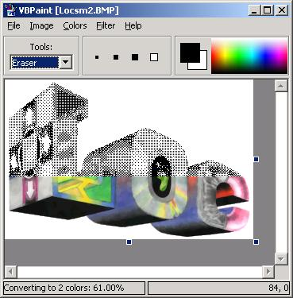



## VBPaint \(Pure VB\!\)

### Description

That's right... not a single line of API, no OCX, or third-party dependencies. All of the paint utilities in this program are coded in pure VB. Features include invert colors, resize, black and white, blur, and more. Please vote.
 
### More Info
 

             |
---                |---
**Submitted On**   |2001-07-19 13:59:00
**By**             |[Loc Nguyen](https://github.com/Planet-Source-Code/PSCIndex/blob/master/ByAuthor/loc-nguyen.md)
**Level**          |Intermediate
**User Rating**    |4.2 (21 globes from 5 users)
**Compatibility**  |VB 4\.0 \(32\-bit\), VB 5\.0, VB 6\.0
**Category**       |[Graphics](https://github.com/Planet-Source-Code/PSCIndex/blob/master/ByCategory/graphics__1-46.md)
**World**          |[Visual Basic](https://github.com/Planet-Source-Code/PSCIndex/blob/master/ByWorld/visual-basic.md)
**Archive File**   |[VBPaint \(P231217192001\.zip](https://github.com/Planet-Source-Code/loc-nguyen-vbpaint-pure-vb__1-25055/archive/master.zip)

